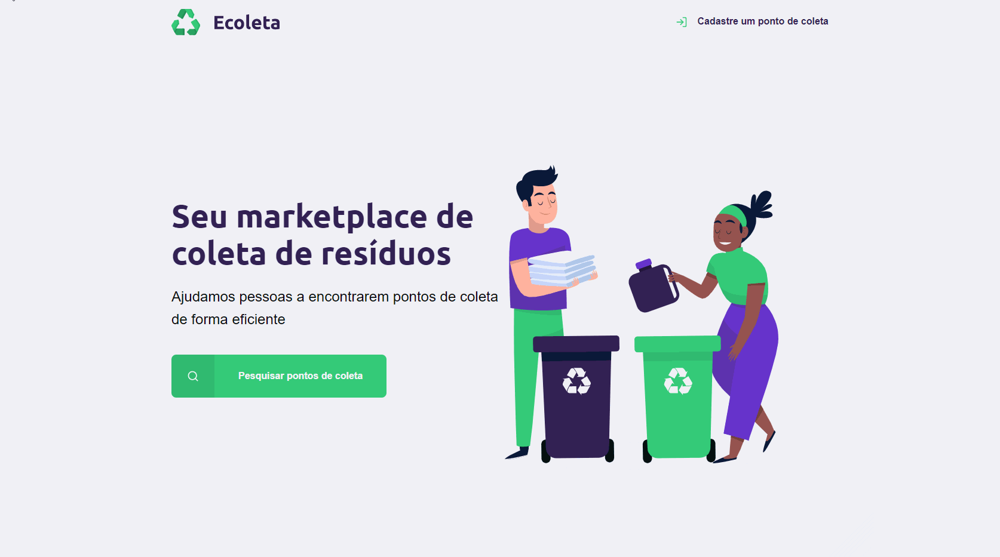

<h1 align="center">
  Ecoleta
</h1>

## 💻 Project

- A weeklong rocketseat bootcamp project. 

- Main technologies: HTML, CSS, Javascript, SQLite3 and Nunjucks.

- A simple website to register a point for selective collection of recyclable waste in Brazil.

&nbsp;&nbsp;

---

## 🔥 Check it out!

- [https://br-ecoleta.herokuapp.com/](https://br-ecoleta.herokuapp.com/)
  

&nbsp;&nbsp;

---

## 🚀 Getting started

Clone this repository and run the following commands inside the project folder:

1. `npm install` or `yarn`;
2. `yarn start`;

To view the project you can open `http://localhost:3000`.

&nbsp;&nbsp;

---
